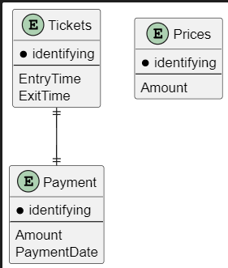
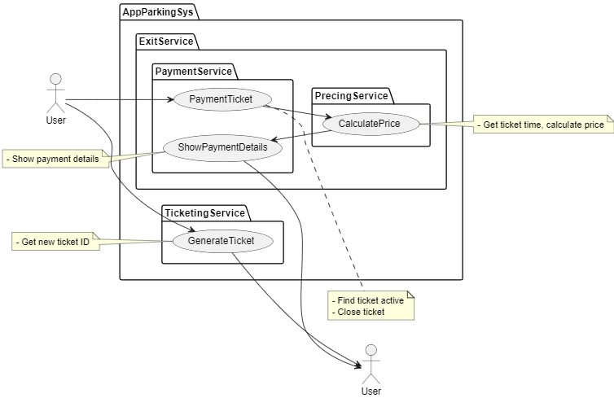
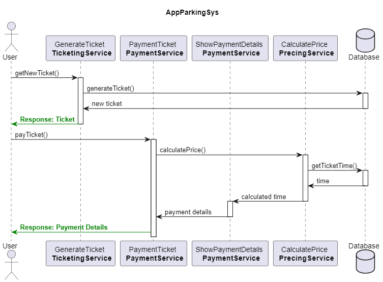

# AppParkingSys-Back

## Overview

This project is a REST API developed with ASP.NET Core 8 that implements a Clean Architecture to ensure maintainability, scalability, and separation of concerns in the code. The solution is organized into four main layers: Web, Core, Infrastructure, and Services, each with specific responsibilities.

### Project Name: API that simulates a parking system

### Technologies Used:

- **ASP.NET Core 8:** Main framework used to develop the REST API.

- **EntityFramework Core:** ORM (Object-Relational Mapping) used to manage the persistence of entities in a SQL Server database.

- **JWT (JSON Web Tokens):** Implemented for user authentication and authorization.

- **BCrypt.Net:** Used to encrypt and verify user passwords.

- **UnitOfWork Pattern:** Design pattern implemented to coordinate the execution of multiple repositories and secure transactions.

- **FluentValidation:** Used to define validation rules for domain entities.

- **AutoMapper:** Used to map objects between different layers of the application.

- **Serilog:** Logging library used to generate detailed and configurable logs.

## Main Features

### Project Layers

**Web**

- This layer contains the REST API controllers and the configuration of the HTTP request pipeline.

- JWT (JSON Web Tokens) authentication is implemented here to secure communications between the client and the API.

- Uses Serilog for logging and generating detailed logs.

- Uses AutoMapper to map domain entities to DTO (Data Transfer Objects) models and vice versa.

- Uses BCrypt.Net to encrypt user passwords before storing them in the database.

**Core**

- Contains the domain entities, repository and service interfaces, as well as business logic.

- Defines the interfaces for implementing the UnitOfWork design pattern and repositories.

**Infrastructure**

- Implements the repositories and the UnitOfWork using EntityFramework Core to handle entity persistence in a Microsoft SQL Server database.

**Services**

- Contains the implementation of application services that interact with the infrastructure layer to execute the business operations defined in the Core layer.

- Includes the validation rules defined with FluentValidation to ensure data integrity.

> This ASP.NET Core 8 backend project is designed to be robust, scalable, and maintainable. The implementation of a Clean Architecture and the use of modern technologies such as JWT, BCrypt.Net, EntityFramework Core, FluentValidation, AutoMapper, and Serilog ensure efficient development and secure operation of the system.

> This system simulates what a parking control system would be like, a ticket dispenser. It only has a small part implemented to simulate the ticket dispenser. It does not have the administrative modules for billing, etc. fully developed. These could be included in the future.

# Screenshots

